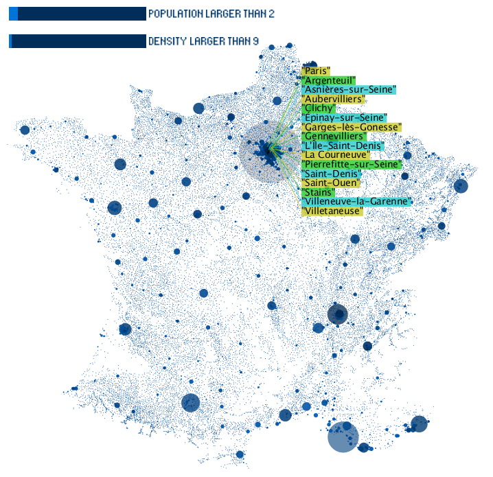

###Infoviz Assignment

###Instruction

#### Data preporcessing

Create a new column "density"= "population"/"surface"
	
#### Data mapping

1. **Population** - Radius of circle, higher population with larger raduis

2. **Population** - Opacity of circle, higher population with lower opacity, which is to handle the overlapping issues

3. **Density** - Brightness(HSB colormode)of circle, higher density with higher brightness
		

	
#### Interaction
1. Mousemove - Highlight places， with excentric labelling for overlapping cites
2. Click - Select Place for details
3. Two sliders for population and density control
4. Zoom and pan supported
	
#### Running at your side
Install ControlP5 library first and then run `assignment.pde`
	
<http://www.sojamo.de/libraries/controlP5/>